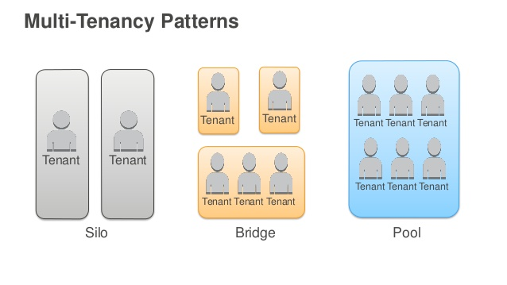
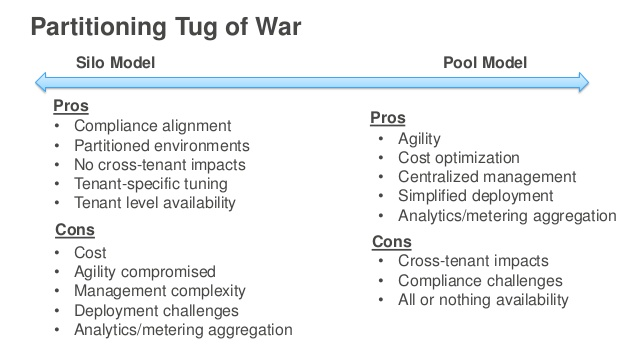
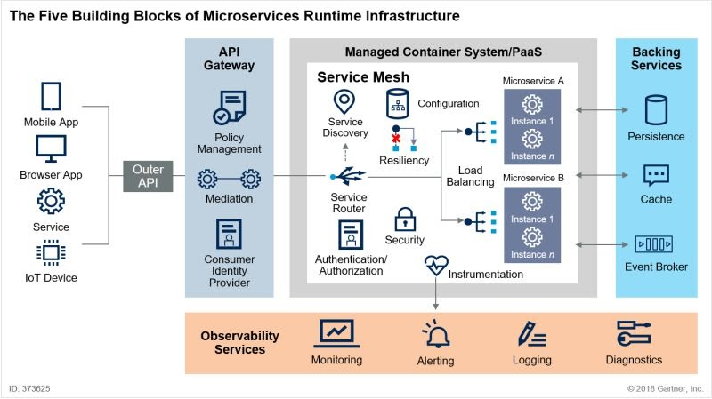

# Design and architecture

## CAP Theorem

The CAP theorem (Brewer's theorem) states that it is impossible for a distributed data store to simultaneously provide more than two out of the following three guarantees.
* __Consistency__: all clients see the same data at the same time, no matter which node they connect to. For this to happen, whenever data is written to one node, it must be instantly forwarded or replicated to all the other nodes in the system before the write is deemed ‘successful.’
* __Availability__: any client making a request for data gets a response, even if one or more nodes are down. Another way to state this — all working nodes in the distributed system return a valid response for any request, without exception
* __Partition tolerance__: A partition is a communications break within a distributed system—a lost or temporarily delayed connection between two nodes. Partition tolerance means that the cluster must continue to work despite any number of communication breakdowns between nodes in the system

When a network partition failure happens should we decide tos
* Cancel the operation and thus decrease the availability but ensure consistency
* Proceed with the operation and thus provide availability but risk inconsistency

Image source: https://medium.com/system-design-blog/cap-theorem-1455ce5fc0a0

The CAP theorem implies that in the presence of a network partition, one has to choose between consistency and availability. Note that consistency as defined in the CAP theorem is quite different from the consistency guaranteed in ACID database transactions.

https://en.wikipedia.org/wiki/CAP_theorem
https://www.ibm.com/cloud/learn/cap-theorem
https://www.youtube.com/watch?v=k-Yaq8AHlFA
https://www.cl.cam.ac.uk/research/dtg/www/files/publications/public/mk428/cap-critique.pdf

### CAP theorem NoSQL database types
NoSQL (non-relational) databases are ideal for distributed network applications. Unlike their vertically scalable SQL (relational) counterparts, NoSQL databases are horizontally scalable and distributed by design—they can rapidly scale across a growing network consisting of multiple interconnected nodes.

Today, NoSQL databases are classified based on the two CAP characteristics they support:
* __CP database__: A CP database delivers consistency and partition tolerance at the expense of availability. When a partition occurs between any two nodes, the system has to shut down the non-consistent node (i.e., make it unavailable) until the partition is resolved.
* __AP database__: An AP database delivers availability and partition tolerance at the expense of consistency. When a partition occurs, all nodes remain available but those at the wrong end of a partition might return an older version of data than others. (When the partition is resolved, the AP databases typically resync the nodes to repair all inconsistencies in the system.)
* __CA database__: A CA database delivers consistency and availability across all nodes. It can’t do this if there is a partition between any two nodes in the system, however, and therefore can’t deliver fault tolerance.

We listed this type last for a reason—in a distributed system, partitions can’t be avoided. So, while we can discuss a CA distributed database in theory, for all practical purposes, a CA distributed database can’t exist. However, this doesn’t mean you can’t have a CA database for your distributed application if you need one. Many relational databases, such as PostgreSQL, deliver consistency and availability and can be deployed to multiple nodes using replication.

### MongoDB and the CAP theorem (CP)
Relative to the CAP theorem, MongoDB is a CP data store—it resolves network partitions by maintaining consistency, while compromising on availability.

_MongoDB_ is a single-master system—each _replica_ set can have only one primary node that receives all the write operations. All other nodes in the same replica set are secondary nodes that replicate the primary node's operation log and apply it to their own data set. By default, clients also read from the primary node, but they can also specify a _read preference_ that allows them to read from secondary nodes.

When the primary node becomes unavailable, the secondary node with the most recent operation log will be elected as the new primary node. Once all the other secondary nodes catch up with the new master, the cluster becomes available again. As clients can't make any write requests during this interval, the data remains consistent across the entire network.

### Cassandra and the CAP theorem (AP)
It’s a wide-column database that lets you store data on a distributed network. However, unlike MongoDB, Cassandra has a masterless architecture, and as a result, it has multiple points of failure, rather than a single one.

Relative to the CAP theorem, Cassandra is an AP database—it delivers availability and partition tolerance but can't deliver consistency all the time. Because Cassandra doesn't have a master node, all the nodes must be available continuously. However, Cassandra provides eventual consistency by allowing clients to write to any nodes at any time and reconciling inconsistencies as quickly as possible.
As data only becomes inconsistent in the case of a network partition and inconsistencies are quickly resolved, Cassandra offers “repair” functionality to help nodes catch up with their peers. However, constant availability results in a highly performant system that might be worth the trade-off in many cases.

### Working with microservices
Understanding the CAP theorem can help you choose the best database when designing a microservices-based application running from multiple locations. For example, if the ability to quickly iterate the data model and scale horizontally is essential to your application, but you can tolerate eventual (as opposed to strict) consistency, an AP database like Cassandra or Apache CouchDB can meet your requirements and simplify your deployment. On the other hand, if your application depends heavily on data consistency—as in an eCommerce application or a payment service—you might opt for a relational database like PostgreSQL.

---

## SQL vs NoSQL
|     | SQL | NoSQL |
| --- | --- | ----- |
| Pros | * Reduced data storage footprint due to normalization and other optimization opportunities. Often results in better performance and more efficient use of resources. * Strong and well-understood data integrity semantics through ACID (Atomicity, Consistency, Isolation, Durability). * Standard access to data via SQL. * Generally more flexible query support capable of handling a broader range of workloads. SQL abstracts over the underlying implementation and allows the engine to optimize queries to fit their on-disk representation. | * Scalable and highly available—many NoSQL databases are generally designed to support seamless, online horizontal scalability without significant single points of failure. * Flexible data models—most non-relational systems do not require developers to make up-front commitments to data models; what schemas do exist can often be changed on the fly. * High performance—by limiting the range of what the database can do (for example, by relaxing durability guarantees) many NoSQL systems are able to achieve extremely high levels of performance. *High-level data abstractions—moving beyond the "value in a cell" data model, NoSQL systems can provide high-level APIs for powerful data structures. Redis, for example, includes a native-sorted set abstraction |
| Cons | * Rigid data models that require careful up-front design to ensure adequate performance and resist evolution—changing a schema will often include downtime * Scaling horizontally is challenging—either completely unsupported, supported in an ad-hoc way, or only supported on relatively immature technologies * Non-distributed engines are generally a "single point of failure" that must be mitigated by replication and failover techniques; no illusion of infinite scalability | * Vague interpretations of ACID constraints—despite widespread claims of ACID support for NoSQL systems, the interpretation of ACID is often made so broad that not much can be gleaned about the semantics of the database in question. For example, what does "isolation" mean without transactions? * Distributed systems have distributed systems problems. While not unique to NoSQL systems, it's the norm, rather than the exception, for developers programming against NoSQL to deeply understand, e.g., CAP Theorem and its interpretation by the database in question. * Lack of flexibility in access patterns—the relational/SQL abstraction gives the database engine broad powers to optimize queries for the underlying data; without that abstraction, the on-disk representation of data leaks into the application's queries and leaves no room for the engine to optimize.|
| When to use? | * Your data has distinct entities with well-defined relationships with one another that must be strictly enforced and/or navigable * Data integrity is very crucial * You want to build reliable applications | * You have highly flexible data models or very specific needs that don't fit into the relational model * You need highly-scalable system and comparatively higher availability

---

## SaaS Application Architecture

### Multi-tenancy

Images source: https://www.slideshare.net/AmazonWebServices/aws-reinvent-2016-architecting-next-generation-saas-applications-on-aws-arc301

---

## Cloud Design Patterns
[Azure - Cloud Design Patterns](https://docs.microsoft.com/en-us/azure/architecture/patterns)

| Availability | Data Management | Design and Implementation |
| ------------ | --------------- | ------------------------- |
| Deployment Stamps Geodes Health Endpoint Monitoring Queue-Based Load Leveling Throttling | Cache-Aside CQRS Event Sourcing Index Table Materialized View Sharding Static Content Hosting Valet Key | Ambassador Anti-Corruption Layer Backends for Frontends CQRS Compute Resource Consolidation External Configuration Store Gateway Aggregation Gateway Offloading Gateway Routing Leader Election Pipes and Filters Sidecar Static Content Hosting Strangler |

| Management and Monitoring | Messaging | Performance and Scalability |
| ------------------------- | --------- | --------------------------- |
| Ambassador Anti-Corruption Layer External Configuration Store Gateway Aggregation Gateway Offloading Gateway Routing Health Endpoint Monitoring Sidecar Strangler | Asynchronous Request-Reply Claim Check Choreography Competing Consumers Pipes and Filters Priority Queue Publisher-Subscriber Queue-Based Load Leveling Scheduler Agent Supervisor Sequential Convoy | Cache-Aside Choreography CQRS Event Sourcing Deployment Stamps Geodes Index Table Materialized View Priority Queue Queue-Based Load Leveling Sharding Static Content Hosting Throttling |

| Resiliency | Security |
| ---------- | -------- |
| Bulkhead Circuit Breaker Compensating Transaction Health Endpoint Monitoring Leader Election Queue-Based Load Leveling Retry Scheduler Agent Supervisor | Federated Identity Gatekeeper Valet Key |

---

## Microservices architecture

### CQRS

The Command and Query Responsibility Segregation (CQRS) pattern separates read and update operations for a data store.

#### Benefits of CQRS include:
* __Independent scaling__: CQRS allows the read and write workloads to scale independently, and may result in fewer lock contentions.
* __Optimized data schemas__: The read side can use a schema that is optimized for queries, while the write side uses a schema that is optimized for updates.
* __Security__: It's easier to ensure that only the right domain entities are performing writes on the data.
* __Separation of concerns__: Segregating the read and write sides can result in models that are more maintainable and flexible. Most of the complex business logic goes into the write model. The read model can be relatively simple.
* __Simpler queries__: By storing a materialized view in the read database, the application can avoid complex joins when querying.

#### CQRS with Event Sourcing
https://dzone.com/articles/microservices-with-cqrs-and-event-sourcing

### Design Principles

#### The Twelve-Factor App
* https://12factor.net/
* https://www.nginx.com/blog/microservices-reference-architecture-nginx-twelve-factor-app/

#### IDEALS
https://www.infoq.com/articles/microservices-design-ideals/

* __Interface segregation__ - different types of clients (e.g., mobile apps, web apps, CLI programs) should be able to interact with services through the contract that best suits their needs.
* __Deployability__ - in the microservice era, which is also the DevOps era, there are critical design decisions and technology choices developers need to make regarding packaging, deploying and running microservices.
* __Event-driven__ - whenever possible we should model our services to be activated by an asynchronous message or event instead of a synchronous call.
* __Availability over consistency__ - more often end users value the availability of the system over strong data consistency, and they’re okay with eventual consistency. 
* __Loose-coupling__ - an important design concern in the case of microservices, with respect to afferent (incoming) and efferent (outgoing) coupling.
* __Single responsibility__ - model microservices that are not too large or too slim because they contain the right amount of cohesive functionality.

### Design Patterns
#### The Five Building Blocks of Microservices Runtime Infrastructure

